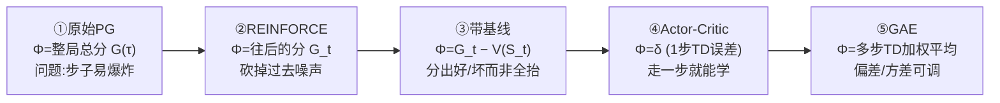
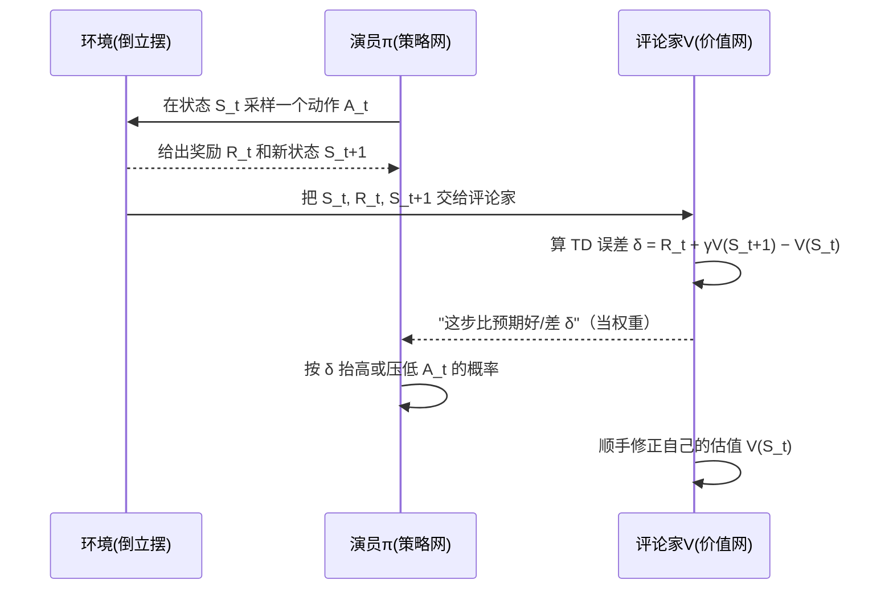

# 05 策略梯度法

🎯 一句话导读：上一章我们知道了"强化学习要训练一个会做决策的智能体"，但到底怎么训？这一章给出最主流的一条路线——策略梯度法（Policy Gradient，说人话就是"直接调整'做决策的那张网'，让它越来越倾向于做能拿高分的动作"）。我们会顺着一条改进链走下来：原始策略梯度 → REINFORCE → 带基线 → Actor-Critic → 多步 TD → GAE，每一步都只解决上一步的一个毛病。看完你就能看懂 ChatGPT 后训练里 RLHF、PPO、GRPO 这些词到底在折腾什么。

## 🌰 先讲个直觉

想象你在带一个新手玩"顶杆子"游戏（推一辆小车，让车上的杆子别倒，这就是经典的倒立摆 / CartPole 环境）。

新手脑子里有一套"看到什么情况就往哪推"的直觉，但一开始这套直觉是瞎蒙的。你要怎么教他变强？

最朴素的办法是这样：让他放手玩一整局，记下他这一局得了多少分。

- 如果这一局打得好（分高）：你就跟他说"你刚才那一连串操作，整体不错，以后多这么干"。

- 如果这一局打得差（分低）：你就说"刚才那套，以后少这么干"。

注意，你没有告诉他"第 37 步你应该往左而不是往右"——因为你也不知道标准答案。你只是根据最终结果，把他"做过的所有动作"整体地往上推或往下压一点点。玩几千局之后，那些能带来高分的动作出现得越来越频繁，他就变强了。

策略梯度法干的就是这件事：

- "新手脑子里的直觉" = 一个神经网络（叫策略网络）；

- "往上推 / 往下压一点点" = 用梯度去微调这个网络的参数；

- "这一局得了多少分" = 回报（Return）。

这一章剩下的全部内容，都是在回答同一个问题："往上推 / 往下压"这个力度，到底该用什么数字来算才最靠谱？ 你会看到 5 个版本的答案，一个比一个聪明。

## 🧩 核心概念（说人话）

### ① 策略（Policy）—— 智能体的"决策习惯"

人话定义：策略就是"在某个状态下，该做什么动作"的规则。我们写成 $\pi(a\mid s)$，读作"在状态 $s$ 下，做动作 $a$ 的概率"。

为什么用概率而不是"铁板钉钉做某个动作"？因为要留点探索空间——偶尔试试别的动作，才知道是不是有更好的选择。

在倒立摆里，策略网络的输入是 4 个数字（车的位置、车的速度、杆的角度、杆的角速度），输出是两个动作的概率，比如"向左推 0.7、向右推 0.3"。我们用 $\theta$（theta）代表这张网里所有可调的参数，把它写成 $\pi_\theta(a\mid s)$。

把强化学习想成一个分类问题会很好理解：输入是状态，输出是"该选哪个动作类"。区别只在于——图像分类有人给你标好的标准答案，而强化学习的"标准答案"得靠智能体自己玩、自己采样出来。

### ② 轨迹与回报（Trajectory & Return）—— "一整局"和"这局的总分"

轨迹（Trajectory）：玩一整局产生的一串"状态—动作—奖励"序列，记作 $\tau$（tau）。

回报（Return）：这一局的总得分，记作 $G$。但它不是简单加总，而是越靠后的奖励打越多折扣（乘上 $\gamma$ 的若干次方，$\gamma$ 是 0~1 的折扣因子）。直觉就是"眼前的奖励比遥远的奖励更实在"。

### ③ 目标函数（Objective）—— 我们到底想最大化什么

我们想要的是：让"平均每一局的总分"尽量高。注意是"平均"——因为策略带随机性，每局分数都在抖，我们要的是期望（多玩很多局的平均值）。这个"平均总分"就是目标函数 $J(\theta)$。

### ④ 梯度上升（Gradient Ascent）—— 朝"更高分"的方向拧参数

训练神经网络时我们一般让"损失最小"，用梯度下降。但这里我们要让"总分最大"，所以反过来用梯度上升：算出"参数往哪个方向拧能让总分变大"，然后就往那个方向拧一点点。方向和力度，都由梯度 $\nabla_\theta J(\theta)$ 给出。

### ⑤ 一个绕不开的麻烦：期望算不出来

目标函数是个期望（所有可能轨迹的加权平均）。可倒立摆能玩 200 步，不同轨迹的数量是个天文数字（约 $2^{200}$），根本没法把每条都算一遍。

怎么办？靠"大数定律"——多采样几局，拿这几局的平均值去近似真实的期望。 这就是后面所有算法都在"采样—估算"的根本原因。

## 📐 必要的公式

整章其实只有一个母公式，剩下全是它的变种。先看母公式。

$$ \nabla_\theta J(\theta) = \mathbb{E}_{\tau\sim\pi_\theta}\!\left[\sum_{t=0}^{T} \Phi_t \,\nabla_\theta \log \pi_\theta(A_t\mid S_t)\right] $$

👆 人话翻译：想让策略变好，就对这一局里每一步做一件事——把"做了当时那个动作的概率"往上抬（这就是 $\nabla_\theta \log \pi_\theta(A_t\mid S_t)$，可以读成"让 $A_t$ 这个动作更可能被选中的拧法"），抬多用力，由前面的权重 $\Phi_t$ 说了算。
- $\Phi_t$ 是正的大数 → 使劲往上抬（"这动作好，多做"）；
- $\Phi_t$ 是负数 → 反着压下去（"这动作差，少做"）。

本章 5 个算法的唯一区别，就是 $\Phi_t$ 用什么。 记住这句话，这一章就通了一半。

那 $\Phi_t$ 到底怎么填？这就是五代算法的进化史：

| 版本 | $\Phi_t$ 用什么 | 解决了上一版什么毛病 |
|------|----------------|---------------------|
| 1. 原始策略梯度 | 整局总分 $G(\tau)$ | —（起点） |
| 2. REINFORCE | 从当前这步往后的分 $G_t$ | 别把"做动作前就已经拿到的分"算进来（那是噪声） |
| 3. 带基线 | $G_t - b(S_t)$ | 全是正分时也能分出"比平均好"还是"比平均差" |
| 4. Actor-Critic | $R_t + \gamma V(S_{t+1}) - V(S_t)$ | 不用等整局结束，走一步就能学 |
| 5. GAE | 多步 TD 的加权平均 $A_t^{\text{GAE}}$ | 在"偏差"和"抖动"之间找平衡 |

下面把这五代逐个讲清"它为什么出现"。

### 第 1 代：原始策略梯度——所有动作共用一个权重

最朴素的版本：$\Phi_t = G(\tau)$，也就是这一局所有动作，都用"整局总分"这同一个权重去抬/压。

这正是开头那个"放手玩一局、根据总分整体调"的直觉。它能用，但毛病明显：如果某局总分特别高（比如 $G=10000$），更新步子会大到离谱，把策略一把拽崩——这叫策略崩溃。好比一个人突然中了一千万，整个人的行为模式直接被这一次巨大奖励带跑偏了。

::: details
想看策略梯度定理的推导（可跳过）

目标函数 $J(\theta)=\mathbb{E}_{\tau\sim\pi_\theta}[G(\tau)]$，难点在于"期望里带着参数 $\theta$，没法直接求导"。推导的关键是一个叫 log 梯度技巧 的恒等式：

$$ \nabla_\theta P(\tau\mid\theta) = P(\tau\mid\theta)\,\nabla_\theta \log P(\tau\mid\theta) $$

它来自最基础的求导规则 $(\log f)' = f'/f$。把期望展开成求和、把梯度挪进求和号、用积的微分法则（注意 $\nabla_\theta G(\tau)=0$，因为回报由环境决定、与 $\theta$ 无关），再套上这个技巧，就得到：

$$ \nabla_\theta J(\theta) = \mathbb{E}_{\tau\sim\pi_\theta}[G(\tau)\nabla_\theta \log P(\tau\mid\theta)] $$

而一条轨迹的概率 $P(\tau\mid\theta)=p(S_0)\prod_t \pi_\theta(A_t\mid S_t)\,p(S_{t+1}\mid S_t,A_t)$，取对数后变成一串加法。其中只有 $\pi_\theta$ 那几项含 $\theta$，环境转移概率 $p(\cdot)$ 对 $\theta$ 求导全是 0，于是：

$$ \nabla_\theta \log P(\tau\mid\theta) = \sum_{t=0}^{T}\nabla_\theta \log \pi_\theta(A_t\mid S_t) $$

代回去就是母公式（$\Phi_t=G(\tau)$ 的版本）。

:::

### 第 2 代：REINFORCE——别把"过去的分"算进来

毛病：第 1 代里，第 $t$ 步动作的权重 $G(\tau)$ 包含了整局的分，连"做这步之前就已经拿到的分"都算进去了。可是——你这一步动作，不可能改变已经发生的过去。把过去的分掺进来，纯属噪声，让训练抖得厉害。

修法：第 $t$ 步只用"从这步往后"的回报，记作 $G_t$（专业叫法是 reward-to-go，剩余回报）。

$$ \Phi_t = G_t = R_t + \gamma R_{t+1} + \cdots + \gamma^{T-t}R_T $$

👆 人话翻译：评价"第 37 步走得好不好"，只看第 37 步之后赚了多少，之前的账一笔勾销。这就是 REINFORCE。

效果：不影响正确性（仍然无偏），但方差更小——训练更稳、更快。

::: details
想看'砍掉过去回报'为什么不改变结果（可跳过）

把整局回报拆成"过去 + 未来"两段：$G(\tau)=G_{<t}+G_{\ge t}$。要证明过去那段在期望下对梯度的贡献为 0：

给定到时刻 $t$ 的历史 $H_t$ 后，$G_{<t}$ 已经是确定值，可以提到期望外面，只剩：

$$ \mathbb{E}[\nabla_\theta \log \pi_\theta(A_t\mid S_t)\mid H_t] = \sum_a \pi_\theta(a\mid S_t)\nabla_\theta \log \pi_\theta(a\mid S_t) = \sum_a \nabla_\theta \pi_\theta(a\mid S_t) $$

（中间用了 log 梯度技巧 $\pi\nabla\log\pi=\nabla\pi$）。而所有动作概率加起来恒等于 1，对常数 1 求导是 0：

$$ \sum_a \nabla_\theta \pi_\theta(a\mid S_t) = \nabla_\theta \sum_a \pi_\theta(a\mid S_t) = \nabla_\theta 1 = 0 $$

所以过去回报项的期望是 0，删掉它不引入偏差，只减少方差。这就是著名的 "reward-to-go" / 因果性技巧。

:::

### 第 3 代：带基线（Baseline）——给分数找个"及格线"

毛病：在倒立摆里，只要杆没倒，每步奖励都是 +1，所以 $G_t$ 永远是正的。这意味着：不管动作好坏，我们都在抬高它的概率，只是抬多抬少的区别。这很蠢——差动作也该被压下去才对。

修法：减去一个基线 $b(S_t)$，把"绝对分"变成"相对分"：

$$ \Phi_t = G_t - b(S_t) $$

👆 人话翻译：别看你考了多少分，看你比平均水平高还是低。比平均好（正）→ 抬概率；比平均差（负）→ 压概率。基线就是那条"及格线 / 平均线"。

基线可以是任意只跟状态有关的函数，实践中最常用的就是价值函数 $V(S_t)$（"在这个状态下，预期还能拿多少分"）。

举个例子：杆已经歪到必倒的状态，不管你怎么推，3 步后都得倒。这时 $G_t=3$，没基线的话还会傻乎乎地抬高当前动作概率；但价值函数早看穿了"这状态就值 3 分"，于是 $G_t - V(S_t)=0$，权重为 0——不瞎调，省掉无谓的训练。

::: details
想看'减基线为什么不引入偏差'（可跳过）

核心是这个恒等式（对任意参数化概率分布都成立）：

$$ \mathbb{E}_{A_t\sim\pi_\theta}[\nabla_\theta \log \pi_\theta(A_t\mid S_t)] = 0 $$

因为 $b(S_t)$ 只跟状态有关、与动作 $A_t$ 无关，可以提出来，于是：

$$ \mathbb{E}_{A_t\sim\pi_\theta}[b(S_t)\nabla_\theta \log \pi_\theta(A_t\mid S_t)] = b(S_t)\cdot 0 = 0 $$

所以减去基线那一项期望为 0，梯度的期望值不变（无偏），但方差能显著变小。注意：不能把 $G_t$ 也这样"提出来"，因为 $G_t$ 是随 $A_t$ 变化的，那一项不为 0。

:::

### 第 4 代：Actor-Critic（演员-评论家）——边玩边学，不用等整局结束

毛病：前面要算 $G_t$，必须等一整局玩完才知道"从这步往后总共赚了多少"。一局没结束，策略和价值网络都动不了。慢。

修法：用时序差分（TD，Temporal Difference）——只往前看一步，用价值网络的预测来"补全"未来：

$$ \Phi_t = \underbrace{R_t + \gamma V_\omega(S_{t+1})}_{\text{走一步看到的}+\text{对未来的估计}} - \underbrace{V_\omega(S_t)}_{\text{原本的估计}} = \delta_t $$

👆 人话翻译：原本要等到局终才知道"这步好不好"；现在改成——走一步，拿"实际拿到的 $R_t$ + 对下一步的估值"去对比"原来的估值"。如果实际比预期好（$\delta_t>0$），说明这动作不错。这个差值 $\delta_t$ 叫 1 步 TD 误差。

这里出现了两张网，正是 "演员-评论家" 名字的由来：

- Actor（演员）= 策略网络 $\pi_\theta$：负责做动作。

- Critic（评论家）= 价值网络 $V_\omega$：负责打分点评。

两张网同时训练：评论家努力让自己的估值 $V_\omega(S_t)$ 逼近"实际看到的 $R_t+\gamma V_\omega(S_{t+1})$"（用均方误差当损失）；演员则听评论家的点评 $\delta_t$ 来调整自己。

⚠️ 这里有个权衡：评论家 $V_\omega$ 是个还没训好的神经网络，它的估计可能有偏差。所以 Actor-Critic 拿"少抖动（方差小、能单步更新）"换来了"可能有点偏（有偏差）"。这正引出了下一代要解决的问题。

### 第 5 代：GAE（广义优势估计）——在"偏"和"抖"之间调一个旋钮

毛病：第 4 代只看 1 步（$\delta_t$），估得稳但偏；而 REINFORCE 那种看到底（$G_t$），没偏但抖。能不能要个中间档，甚至给个旋钮自由调？

先看"看几步"的家族（多步 TD 误差），看的步数越多，越接近真实回报、偏差越小，但抖动越大：

$$ A_t^{(k)} = \sum_{l=0}^{k-1}\gamma^l \delta_{t+l} $$

👆 人话翻译：$A_t^{(1)}$ 只看 1 步，$A_t^{(2)}$ 看 2 步……看得越多越接近"真账"，但也越受运气干扰。

GAE（Generalized Advantage Estimation，广义优势估计） 的做法很聪明：不选某一个 $k$，而是把"看 1 步、看 2 步、看 3 步……"的结果做指数加权平均，用一个超参数 $\lambda$（0~1）当旋钮：

$$ A_t^{\text{GAE}} = \sum_{l=0}^{\infty}(\gamma\lambda)^l \,\delta_{t+l} $$

👆 人话翻译：$\lambda$ 是"偏差—方差"调节旋钮。
- $\lambda=0$：退化成只看 1 步（= Actor-Critic，稳但偏）；
- $\lambda=1$：退化成看到底（= 蒙特卡洛，准但抖）；
- 中间值（实践常用 0.95）：两头的好处都沾一点。

实现上有个超好用的递推公式（从后往前算，一遍搞定）：

$$ A_t^{\text{GAE}} = \delta_t + \gamma\lambda\, A_{t+1}^{\text{GAE}} $$

👆 人话翻译：从最后一步往回倒着扫一遍，每步的优势 = 本步 TD 误差 + 打折后的"后一步优势"。这就是 PPO、GRPO 等现代算法里真正在跑的那行代码。

至此，母公式里的 $\Phi_t$ 也常被统称为优势函数（Advantage Function，$A(s,a)$）——衡量"在状态 $s$ 下做动作 $a$，比平均水平好多少"。强化学习里大量的花活儿，本质都是在改进这个 $\Phi_t$ 怎么算。

## 💻 代码长什么样

先看最朴素的策略网络（一张 4→128→2 的小网，输出两个动作的概率）：

```python
class PolicyNet(nn.Module):           # 演员：决定做什么动作
    def __init__(self, action_size):
        super().__init__()
        self.l1 = nn.Linear(4, 128)   # 输入：倒立摆状态的 4 个数字
        self.l2 = nn.Linear(128, action_size)  # 输出：每个动作一个分

    def forward(self, x):
        x = F.relu(self.l1(x))
        return F.softmax(self.l2(x), dim=1)  # softmax 把分数变成概率
```

再看进化的核心——Actor-Critic 的一次更新（多了一张价值网 self.v，单步即可更新）：

```python
def update(self, state, action_prob, reward, next_state, done):
    # ① 评论家：让 V(S_t) 逼近 "R_t + γ·V(S_{t+1})"
    target = reward + self.gamma * self.v(next_state) * (1 - done)  # TD 目标
    v = self.v(state)                                # 原本的估值 V(S_t)
    loss_v = F.mse_loss(v, target.detach())          # 估值与目标的均方差

    # ② 演员：用 TD 误差 δ 当权重，调整动作概率
    delta = (target - v).detach()                    # δ = R_t + γV(S_{t+1}) − V(S_t)
    loss_pi = -torch.log(action_prob) * delta        # 母公式里的 Φ_t = δ

    # 两张网各自反向传播、各自更新
    self.optimizer_v.zero_grad(); loss_v.backward();  self.optimizer_v.step()
    self.optimizer_pi.zero_grad(); loss_pi.backward(); self.optimizer_pi.step()
```

注意 delta.detach()：评论家给的点评只当成一个"固定的权重数字"喂给演员，不让演员的梯度顺着这条线倒灌进评论家——两张网各管各的。

从原始策略梯度到 Actor-Critic，改动其实只有几行：把权重从 G（整局总分）换成 G_t（reward-to-go）换成 G_t - V（减基线）换成 delta（TD 误差）。母公式的骨架一行没变。

## 🗺️ 一图看懂

第一张图：**五代算法的进化链**，每一步只改"权重 $\Phi_t$"。



第二张图：**Actor-Critic 一个回合里两张网怎么配合**。



## 🧠 产品经理 take

- **这一章是看懂 RLHF / PPO / GRPO 的钥匙。** ChatGPT、Claude 做"对齐"时跑的强化学习，骨架就是本章的母公式：让模型"多做能拿高分（人类更喜欢）的回答"。区别只在 $\Phi_t$ 怎么算、怎么防崩溃。

- **"方差 vs 偏差"是贯穿全章的产品权衡。** 抖（方差大）→ 训练慢、不稳、烧更多算力；偏（偏差大）→ 可能学歪、收敛到次优。GAE 的 $\lambda$ 就是把这个权衡做成一个可调旋钮——这思路在很多工程系统里都通用。

- **"策略崩溃"是真实风险，不是理论玩具。** 一次异常大的奖励/惩罚就可能把好不容易训出来的策略一把拽崩。所以下一章的 PPO 专门加了"步子别迈太大"的护栏——这也是为什么生产级 RL 几乎不用裸的策略梯度。

- **奖励设计 = 产品定义。** 智能体只会拼命最大化你给的分。奖励设歪了（比如只奖"回答长"），模型就会学会"废话连篇"。在 RLHF 里，"奖励"来自人类偏好或奖励模型，**这个信号的质量直接决定模型的行为上限**。

::: tip 一句话记住
策略梯度法 = "做得好的动作多做、做得差的少做"；五代算法只是在反复打磨"做得好/差"这把尺子（权重 $\Phi_t$）——从"整局总分"一路进化到"可调旋钮的优势估计 GAE"。
:::

**上一章**：[04 强化学习是什么](/02-rl-basics/01-concepts) ｜ **下一章**：[06 PPO：稳一点的策略更新](/04-ppo/01-theory)

🔗 上一章：04 强化学习是什么 ｜ 下一章：06 PPO：稳一点的策略更新


              